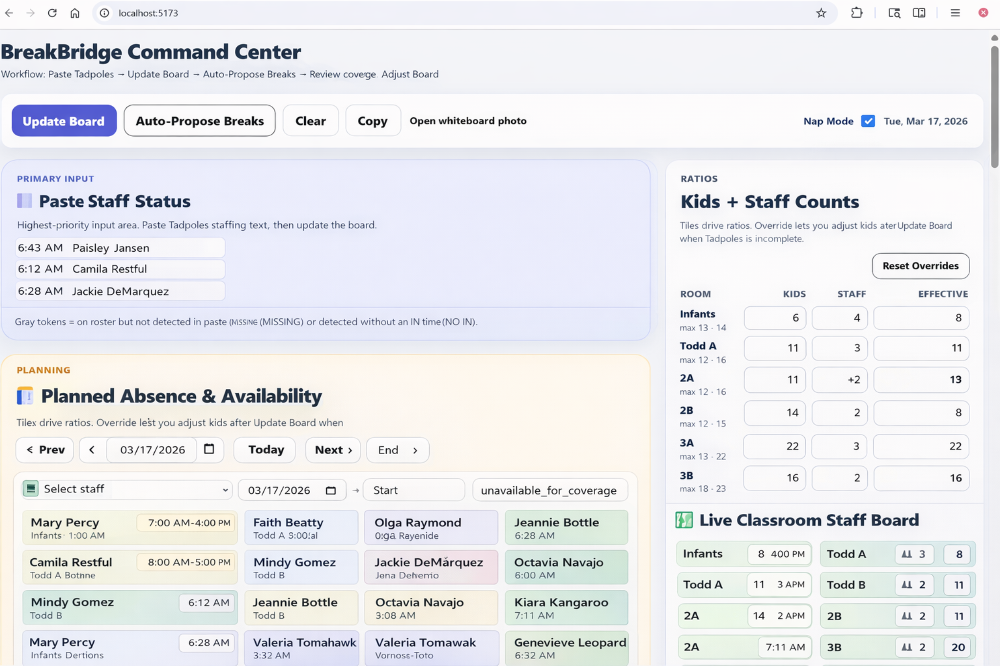
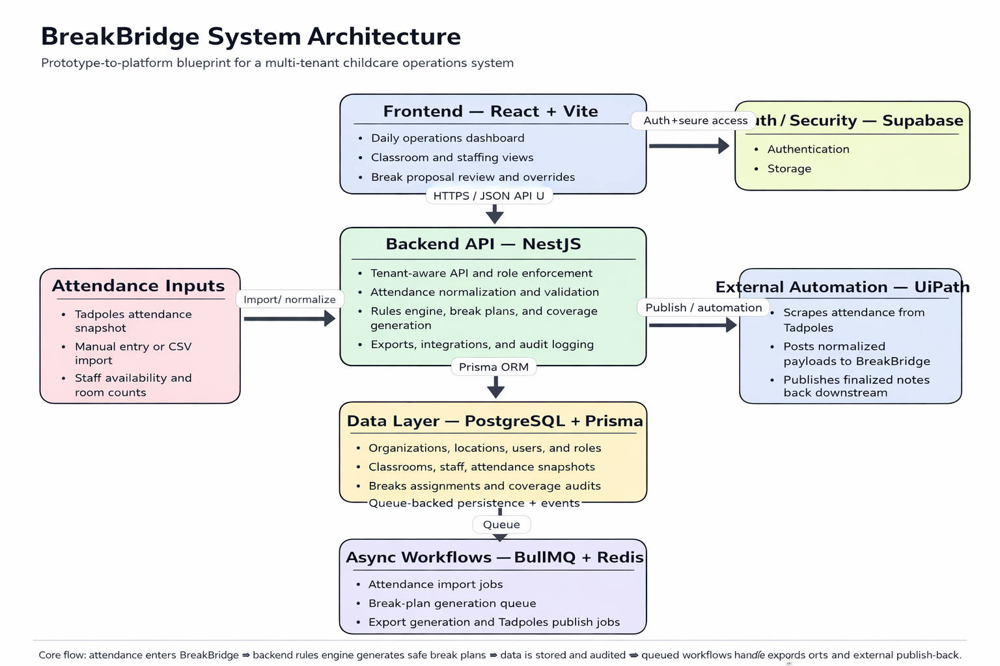

# BreakBridge

**The live break scheduling and staffing decision platform for childcare operations**

  

BreakBridge is a real-time workforce coordination system designed to help childcare administrators safely schedule employee breaks while maintaining classroom staffing ratios.

It transforms a manual, high-risk daily workflow into a structured, coverage-aware decision system.

---

## 🚧 Status

🚧 Currently evolving from prototype to production architecture  
(Supabase + Render deployment in progress)

---

## 🧠 What BreakBridge Does

Childcare centers must constantly balance:

- strict staff-to-child ratios  
- employee break requirements  
- fluctuating classroom conditions  
- limited coverage staff  

BreakBridge models this as a **constraint-driven system** and generates safe break plans in real time.

---

## 🔥 Key Capabilities

- Live classroom staffing dashboard  
- Ratio-based room status (Green / Fragile / Maxed)  
- Auto-generated break proposals  
- Coverage assignment planning  
- Attendance import workflow  
- Break plan summaries and exports  
- Staff exclusions and overrides  
- Operational constraint modeling  

---

## ⚙️ Core Workflow

1. Import or paste attendance data  
2. Normalize staffing snapshot  
3. Evaluate classroom ratios  
4. Generate break proposals  
5. Assign coverage  
6. Review and override  
7. Finalize and export  

---

## 🧠 System Design Philosophy

BreakBridge is not just a scheduling UI.

It is an **operational decision-support platform** that:

- models real-world staffing constraints  
- evaluates safety conditions in real time  
- proposes valid actions (not just displays data)  

---

## 🏗️ Architecture Overview

High-level system:

- **Frontend:** React + Vite  
- **Backend:** NestJS (modular monolith)  
- **Database:** PostgreSQL + Prisma  
- **Auth / Storage:** Supabase  
- **Async Jobs:** BullMQ + Redis  
- **Automation:** UIPath  

---

## 🧠 BreakBridge Rules Engine

At the core of BreakBridge is a rules engine that evaluates staffing conditions and generates safe break proposals.

It evaluates:

- classroom staffing levels  
- teacher eligibility  
- coverage availability  
- ratio requirements  
- break windows  
- sequencing constraints  

The system transforms a real-time staffing snapshot into a structured break plan.

For a deeper technical explanation, see:

📄 `/docs/rules-engine.md`

---

## 🧱 Multi-Tenant SaaS Design

BreakBridge is designed as a multi-tenant platform:

- Organizations → Locations → Classrooms  
- Each location operates independently  
- Users are scoped by role and access  
- All operational data is tenant-isolated  

---

## 🔐 Security & Architecture Boundaries

BreakBridge enforces strict separation between frontend and backend responsibilities.

The frontend does NOT handle:

- rules engine logic  
- tenant authorization  
- role enforcement  
- import normalization  
- export generation  
- audit logging decisions  

These are handled server-side for security and consistency.

---

## ⚠️ Public Repository Note

Some implementation details are intentionally abstracted or omitted in this public repository for security and production-hardening reasons.

---

## 📈 What This Project Demonstrates

This project demonstrates:

- real-world system modeling  
- constraint-based decision systems  
- full-stack architecture design  
- multi-tenant SaaS thinking  
- operational workflow translation into software  

---

## 🚀 Future Development

- Full backend implementation (NestJS)  
- Database persistence (PostgreSQL + Prisma)  
- Rules engine expansion  
- Async job processing  
- UIPath integration  
- Audit logging  
- Multi-location scaling  

---

## 👤 Author

**Gordon Martin**

Software Engineer focused on building systems that reduce operational friction, automate workflows, and improve reliability in real-world environments.